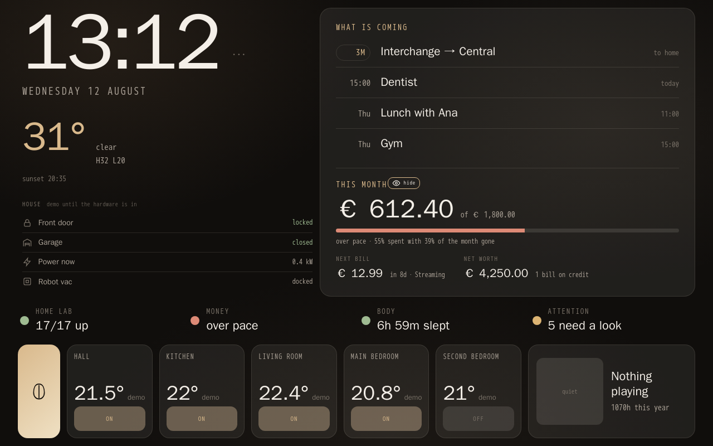
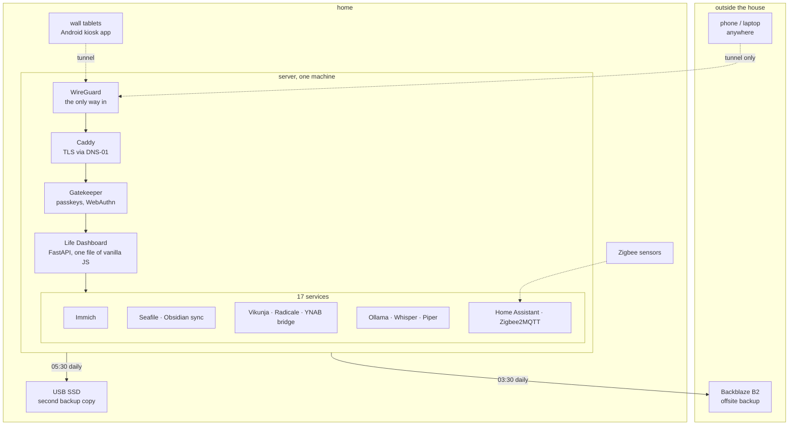
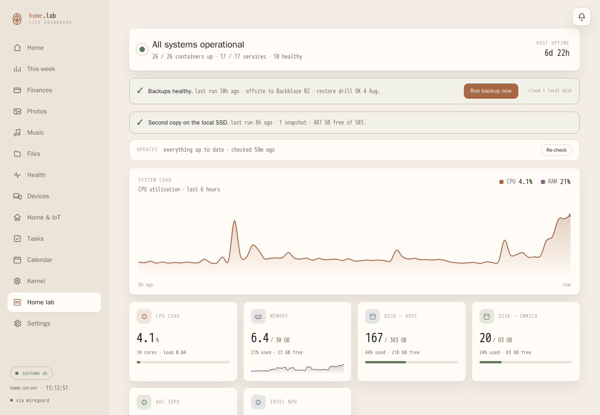
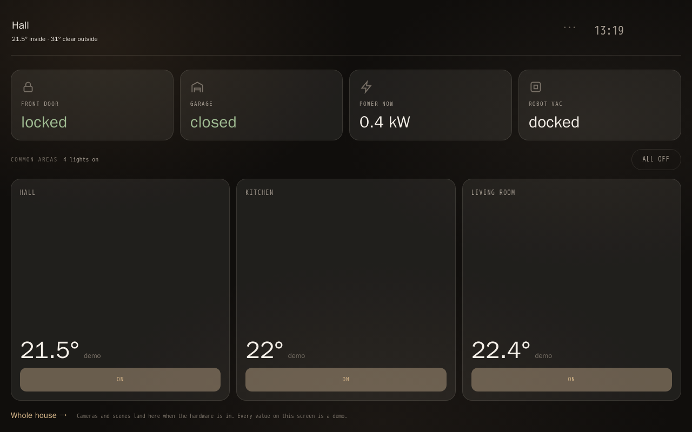
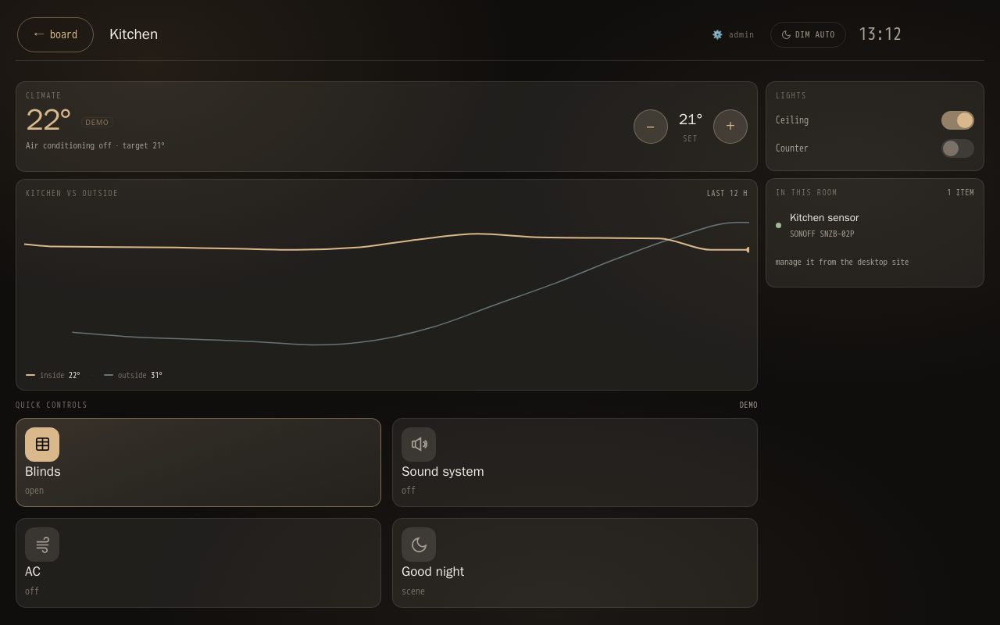
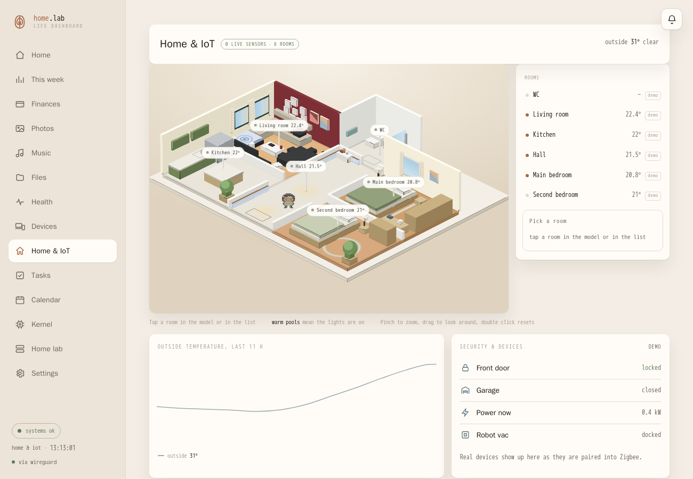

# Home lab, and the dashboard that runs it

A self-hosted home lab and a personal "life dashboard", built and operated by one person.
17 services, 26 containers, reachable only over a private tunnel, with passkeys in front of
anything that changes state. This repository is about the **decisions**, not the code: what
was built, why it was built that way, and what turned out to be wrong.

Everything here is running in production, at home, and used daily. Numbers in this document
come from the live system, not from memory.

*The wall tablet. Clock and weather on the left, the next thing that will happen on the right,
four status beads across the middle, and the rooms along the bottom. Every screenshot here is
in demo mode: room names, figures, events and locations are substituted.*

---

## What it is

**Nothing is exposed to the open internet.** There is no port forwarding. The only way in is
the tunnel, and once inside, anything that changes state asks for a passkey.

---

## The decisions worth explaining

### Backups: two copies that do not share a history

The obvious design is one repository, mirrored. It is also wrong: a mistaken `forget` on the
source propagates to the mirror, and you find out when you need it. So there are **two
independent restic repositories**, one on Backblaze and one on a USB SSD at home. Each one
stands on its own.

The cloud copy survives fire and theft. The local copy restores in minutes instead of hours,
which matters more often than fire does. A run of the local copy takes 33 seconds for 17 GB.

Two habits make this real rather than theatre:

- a **monthly restore drill** that actually restores files and reports whether it worked. A
  backup nobody has restored from is a hope, not a backup.
- a **weekly integrity check** that reads a random 5% of the local repository, because cheap
  USB enclosures lie about what they wrote.

The recovery runbook was rehearsed on a clean machine: fake server, real backup, files
deleted, guide followed to the letter. It found that the old restore script had been broken
since the provider migration, aborting on a missing file from the previous setup. That is the
kind of thing you only discover by rehearsing.

*Both copies reported side by side, with the age of the last run, snapshot count and free
space. The green bar becomes a warning if the local copy goes 48 hours without running.*

[Full write-up](docs/backups.md)

### The wall panel cannot overflow, by construction

Wall tablets show a fixed screen with no scrolling. The first version clipped text, and the
usual fix, tuning heights until it fits, fails the moment the data grows: seven calendar
events instead of two, a three-line service advisory, one more bill.

The rule that fixed it: **no region renders a list whose length depends on data**. The board
shows one upcoming thing, four status beads, five rooms. Always. Height becomes a function of
type size alone, which is a variable under control.

Where space still runs short, it **scales the region down a notch rather than hiding a line**.
Losing 8% of type size is invisible; losing the "next bill" row is exactly what reads as
broken.

There was also a cause no amount of CSS would have fixed: the Android WebView multiplies every
font size by the system font scale, so a device with larger text set silently broke a layout
that measured perfectly on a desktop. Measured: clean at 100%, four cards clipped at 115%,
five at 130%.

<table>
<tr>
<td width="50%"></td>
<td width="50%"></td>
</tr>
<tr>
<td><em>By the door: what is locked, what is on, and one button to turn the shared rooms off
on the way out.</em></td>
<td><em>A room: climate, its history against outside, and what lives in it, pulled from the
same inventory the assistant answers from.</em></td>
</tr>
</table>

[Full write-up](docs/kiosk.md)

### Measure the thing, do not look at it

A recurring lesson, learned the expensive way. Screenshots proved nothing:

- a card that looked fine was clipping 65 pixels of content, found by comparing each tile's
  content height against its box, not by looking
- idle "flicker" was quantified as DOM mutations per 70 seconds, then driven from a full
  repaint every 30s down to **1 mutation, the clock**
- the finance values were always tested masked, which is the default, so the layout was never
  exercised with the numbers actually visible. The bug lived exactly there.

Each of these has a small harness in the repo of the dashboard: headless Chrome, a script, a
number. None of them is clever. They just replace opinion with a measurement.

### A local model, kept honest

The assistant runs on the machine: an 8B model on the integrated GPU. No prompt, no receipt,
no financial figure leaves the house.

Small models make things up, and the interesting work is the guardrails:

- **rankings are sorted server-side**, because the model reorders them when asked to rank
- tools return explicit field names and the system prompt says to answer only from fields
  present in the result
- a date extracted from a receipt is only accepted **if it appears literally in the text**,
  after the model invented today's date for a purchase
- `format: json` plus disabling the thinking phase cut receipt reading from 25s to 5s: 344
  thinking tokens to produce a 74-token object

[Full write-up](docs/local-ai.md)

### Statistics that admit ignorance

The dashboard looks for correlations between sleep, steps, spending, mood and music. With 21
pairs and a 5% threshold, a false positive is guaranteed. So: **p < 0.01**, a minimum of 14
days where both metrics exist, and every pattern shows its correlation and the number of days
behind it. When there is not enough data it says so instead of inventing a pattern.

A trap found while testing: mixing real days with synthetic ones at different scales creates a
correlation out of nothing. Two populations, r = 0.62, entirely artificial.

### Honest labelling

The house has real sensors in some rooms and none in others. Every reading that is a
placeholder is labelled **demo**, in the interface, permanently, until the hardware exists.
The temptation to show a plausible number is strong and always wrong: a dashboard that lies
once cannot be trusted again.

---

*The floor plan is real geometry, drawn from a sketch on paper. Every room without a sensor is
labelled demo, permanently, until the hardware exists. In this screenshot the demo mode has
also replaced the room names and the outside location.*

---

## Stack

| Layer | Choice | Why |
|---|---|---|
| Ingress | WireGuard, no open ports | nothing to scan, nothing to brute force |
| TLS | Caddy with DNS-01 | real certificates for a domain that resolves to a private address |
| Auth | Passkeys, WebAuthn | per-action, not per-session, for anything that changes state |
| Dashboard | FastAPI, vanilla JS, no build step | one file, no toolchain to rot |
| Backups | restic, two repositories | dedup, encryption, and a proven restore |
| Home | Home Assistant, Zigbee2MQTT | local control, no vendor cloud |
| AI | Ollama, Whisper, Piper | everything stays on the machine |

**17 services** across media, files, productivity and infrastructure. **26 containers.**
One machine, no orchestrator: at this size, Kubernetes would be more moving parts than
the thing it runs.

---

## What is not here

This repository holds architecture and reasoning. The dashboard's source lives elsewhere and
is being prepared for publication separately: it needs a history rewrite first, because
early commits contain configuration with credentials in them. Publishing before that would
be the most expensive kind of portfolio mistake.

---

*Written from the live system in August 2026. If a number appears here, it was read from the
running machine rather than remembered.*
